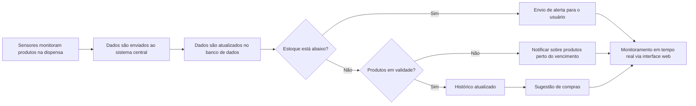

# DispensaIOT
DispensaIOT é um projeto que visa desenvolver uma aplicação para automação de dispensas, integrando tecnologias de IoT (Internet of Things) para monitorar e gerenciar estoques de forma inteligente. Este repositório abrange tanto o back-end quanto o front-end, oferecendo uma solução completa para controle eficiente de uma dispensa automatizada.

- Back-end: Responsável pelo gerenciamento dos dados da dispensa, incluindo a comunicação com dispositivos IoT e o processamento das informações.
- Front-end: Interface amigável para visualização e controle em tempo real, facilitando a interação do usuário com a dispensa automatizada.

# 🛒 **Product Requirements Document (PRD) - Monitoramento de Dispensa**

## 1. 🌟 **Introdução & Objetivos**

O **Monitoramento de Dispensa** é um sistema que utiliza sensores inteligentes instalados em uma dispensa para rastrear e monitorar a quantidade e movimentação dos produtos armazenados. As informações são enviadas para um aplicativo web, permitindo que os usuários:

- Visualizem o inventário em tempo real 📊
- Identifiquem itens que estão faltando ou próximos de acabar 📦
- Rastreiem a movimentação dos produtos (adicionados ou retirados) 🔄

**Objetivo**: Automatizar o gerenciamento de itens essenciais na cozinha, proporcionando maior controle, redução de desperdícios e eficiência nas compras, evitando a falta de produtos importantes.

## 2. 🤔 **Por que implementar isso?**

- **Otimização de compras** 🛍️: Sugestão automática de produtos que precisam ser repostos, evitando listas manuais de compras.
- **Redução de desperdício** ♻️: Visão clara de quais produtos estão perto da validade ou com pouco uso.
- **Facilidade de acesso às informações** 📱: Monitoramento da dispensa remotamente via aplicativo.
- **Automação e integração** 🤖: Possível integração com assistentes virtuais e e-commerce, automatizando compras de itens em falta.

## 3. 🎯 **Público-alvo**

- **Famílias ocupadas** 👨‍👩‍👧‍👦: Pessoas com pouco tempo para gerenciar a cozinha.
- **Profissionais de gastronomia e pequenas empresas** 👨‍🍳: Restaurantes e padarias que precisam de precisão no controle de estoque.
- **Usuários preocupados com sustentabilidade** 🌍: Monitoramento que evita desperdícios.

## 4. 👤 **Personas**

- **Lucas**, 34 anos, chefe de cozinha:  
  Lucas usa o sistema para garantir que ingredientes estejam disponíveis e frescos, evitando prejuízos em seu restaurante.

- **Fernanda**, 28 anos, mãe de dois filhos:  
  Fernanda utiliza o sistema para evitar a falta de itens essenciais, economizando tempo ao planejar suas compras.

- **Roberto**, 45 anos, empresário dono de uma padaria:  
  Roberto precisa de precisão para garantir que ingredientes-chave, como farinha e açúcar, estejam sempre disponíveis.

## 5. 🛠️ **Requisitos Funcionais**

### 1. **Cadastro de Produtos** 📋  
   - Permitir o cadastro manual dos produtos, incluindo nome, categoria, peso, quantidade e validade.

### 2. **Leitura Automática dos Sensores** 📡  
   - Captura e envio dos dados de peso/quantidade dos produtos para o sistema.

### 3. **Alertas e Notificações** 🚨  
   - Emissão de alertas para níveis baixos de produtos e proximidade da validade.

### 4. **Histórico de Movimentação** 🔄  
   - Histórico de entradas e saídas dos produtos, permitindo visualização de consumo e reposição.

### 5. **Sugestões de Compras** 🛒  
   - Sugestão automática de compras com base nos padrões de uso.

### 6. **Interface de Monitoramento em Tempo Real** 📱  
   - Interface web com gráficos e tabelas que mostram o estado da dispensa em tempo real.

### 7. **Relatórios** 📊  
   - Geração de relatórios mensais sobre o uso dos produtos, consumo, e desperdício.

## 6. ⚙️ **Requisitos Não Funcionais**

### 1. **Escalabilidade** 📈  
   - Suportar um grande número de sensores e usuários simultaneamente sem afetar a performance.

### 2. **Segurança e Privacidade** 🔒  
   - Dados dos usuários criptografados e protegidos contra acessos não autorizados.

### 3. **Compatibilidade com dispositivos móveis** 📱  
   - Interface web responsiva para uma boa experiência em smartphones e tablets.

### 4. **Usabilidade e Interface Intuitiva** 🖥️  
   - Interface fácil de usar, com foco na simplicidade e clareza, mesmo para usuários não técnicos.

## 7. 📜 Normas e Legislações Aplicáveis

- Boas Práticas de Engenharia de Software:
Garantir a manutenção do código e sua extensibilidade, utilizando metodologias ágeis e padrões de projeto reconhecidos.

## Diagrama de Decisão sobre o funcionamento da aplicação WEB

# Ata de Reunião

**Data:** 06/11/2024  
**Horário:** 20:00  
**Local:** Presencial  

## Participantes
- Bruno (Equipe ADS)  
- Daniel (Equipe ADS)  
- Luiz (Equipe ADS)  
- Melina (Equipe ADS)  
- Milena (Equipe ADS)  
- Rafael (Equipe ADS)  
- Marcelo (Equipe Mecatrônica)  

---

## Assunto Principal
Integração do projeto de uma dispensa inteligente, por parte da equipe de Mecatrônica do Marcelo, com sistemas de backend e frontend da equipe de ADS.

---

## Pontos Discutidos
- Abordagem para integrar o sistema de monitoramento da dispensa (câmera + ESP32) com uma interface que receba imagens da câmera e informações da ESP32.  

---

## Decisões Tomadas
- Definir a separação de tarefas e a execução do projeto.  
- Desenvolver a interface utilizando **Node.js**.  
- Implementar o backend em **C#**, responsável por receber os sinais da ESP32 e as imagens da câmera.

---

## Ações e Responsáveis
- **Parte de Mecatrônica:** Marcelo  
- **Backend:** Bruno, Luiz e Rafael  
- **Frontend:** Bruno, Daniel, Melina e Milena  

---

## Data e Hora da Próxima Reunião
Não aplicável no momento.   

---

**Elaborado por:**  
Rafael Serio Sinkevicius 
**Data:** 27/11/2024  
